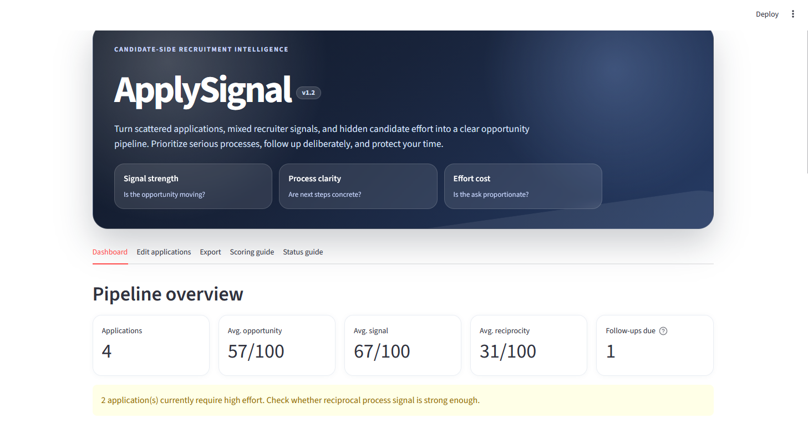
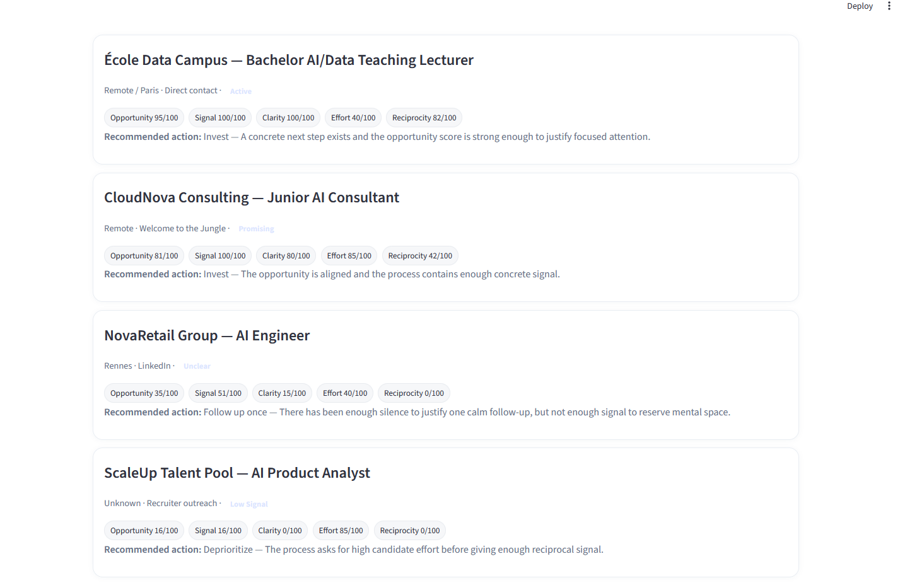
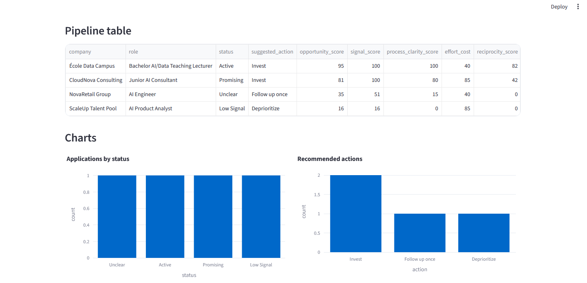
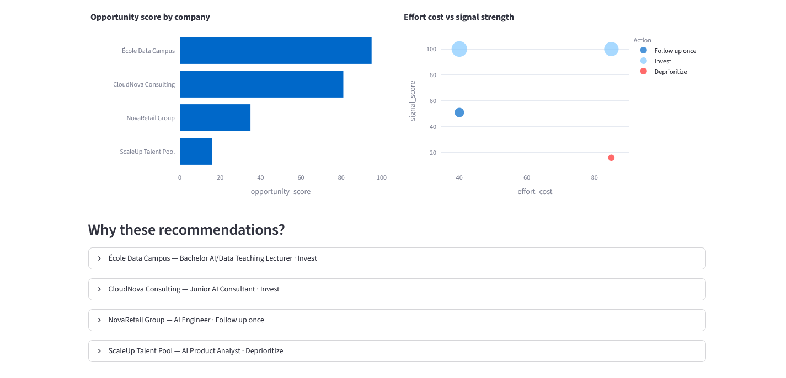

# ApplySignal


**Candidate-side recruitment intelligence dashboard for tracking job applications, scoring process signals, and prioritizing opportunities.**

ApplySignal helps job seekers turn scattered applications, mixed recruiter signals, and hidden candidate effort into a clear opportunity pipeline. It is intentionally framed as a **personal workflow and decision-support utility**.

---

## Preview









---

## What it does

ApplySignal lets candidates track each opportunity and score it across several practical dimensions:

- **Signal strength** — is the opportunity visibly moving?
- **Process clarity** — are next steps, contacts, salary, and timeline clear?
- **Candidate effort cost** — how much work is the candidate being asked to provide?
- **Reciprocity** — is the company giving enough information and attention in return?
- **Opportunity score** — a combined score that helps prioritize where to invest energy.

The app then suggests neutral next actions such as:

- **Invest**
- **Monitor**
- **Follow up once**
- **Low-effort only**
- **Deprioritize**
- **Archive**

---

## Why this exists

Modern job searches can create asymmetrical experience. Candidates may be asked for tailored CVs, cover letters, forms, asynchronous videos, tests, and work samples before receiving clear information about salary, timeline, remote policy, or next steps.

ApplySignal turns that uncertainty into a calm decision-support process:

> **Invest proportionally to the clarity and reciprocity of the opportunity.**

The goal is to help candidates manage uncertainty, document signals, and protect their time during a complex recruitment pipeline.

---

## Features

- Local job application tracking
- Manual opportunity entry
- Demo data loader for portfolio screenshots
- Signal, clarity, effort, reciprocity, and opportunity scoring
- Recommendation logic for next actions
- Application cards with score badges
- Pipeline table
- Charts for:
  - applications by status
  - recommended actions
  - opportunity score by company
  - effort cost vs signal strength
- Scoring guide and status guide
- CSV export
- Local CSV persistence

---

## Screenshots

### Recruitment signal overview


### Opportunity triage cards


### Pipeline and visual analysis


### Recommendation rationale


---

## Installation

Clone the repository:

```bash
git clone https://github.com/MinervaRose/applysignal.git
cd applysignal
```

Create a virtual environment and install dependencies.

### Windows PowerShell

```powershell
python -m venv .venv
.venv\Scripts\python.exe -m pip install -r requirements.txt
.venv\Scripts\python.exe -m streamlit run app.py
```

### macOS / Linux

```bash
python -m venv .venv
source .venv/bin/activate
pip install -r requirements.txt
streamlit run app.py
```

---

## Data storage

ApplySignal stores application data locally in:

```text
data/applications.csv
```

This keeps the MVP simple, transparent, and easy to export or reset.

The repository can include:

```text
data/.gitkeep
```

so that the `data/` folder exists without committing personal application data.

---

## Product positioning

ApplySignal does **not** claim that a weak process signal means a company is bad.

It simply helps candidates manage uncertainty by asking practical questions:

- Is there a concrete next step?
- Has a human decision-maker engaged?
- Is the salary or contract information clear?
- Is the requested effort proportionate?
- Is the company giving enough reciprocal signal to justify more candidate time?

This makes the project useful as a small example of:

- human-centered product design
- decision-support logic
- candidate experience tooling
- recruitment pipeline analysis
- Streamlit dashboard development
- practical data visualization

---

## New in v1.2

- Polished dashboard layout
- Better visual hierarchy and metric cards
- Priority application cards
- Cleaner status guide
- Improved chart layout
- Better small-data empty state

---

## Roadmap ideas

Possible future improvements:

- Job description parser
- Email/import workflow
- Follow-up reminders
- Salary benchmark helper
- LLM-generated opportunity summary
- Privacy-first local desktop version
- Streamlit Community Cloud deployment
- Export to Markdown or Notion

---

## License

This project is released under the MIT License.
